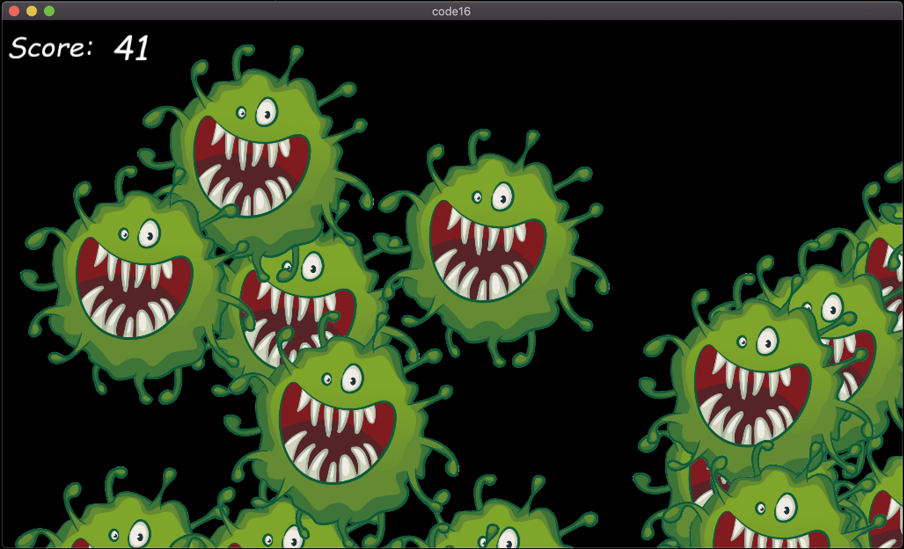

# #hot16challenge
There's an initiative in Poland to raise money for polish healthcare during the pandemic. Originated by the rap community, the challenge is to create a 16 verse long song to support the noble cause. If you wish to donate, please go ahead!

https://www.siepomaga.pl/hot16challenge

## #hot16codechallenge
Idea is the same, but tool is different. Let's show some 16 line code!

### CovKiller
... is a simple 2D Godot based game created with only 16 lines of code (excluding engine autogenerated files)!



The game can be played via [Godot](https://godotengine.org/) game engine.

The entire game code is just 2 files:
### *scene_script.gd*
```python
extends Node
var random = RandomNumberGenerator.new(); var time = 0; var score = 0
func _process(delta):
	self.time += delta
	if time > 0.5:
		var covid = load("res://Covid.tscn").instance()
		covid.connect("select", self, "on_unit_select")
		covid.position = Vector2(random.randf_range(0, get_viewport().get_visible_rect().size.x), random.randf_range(0, get_viewport().get_visible_rect().size.y))
		add_child(covid)
		self.time = 0
func on_unit_select():
	self.score += 1; get_node("score").set_text(str(self.score))
```
### *covid_script.gd*
```python
extends Area2D; signal select
func _on_Covid_input_event(viewport, event, shape_idx):
	if (event is InputEventMouseButton && event.pressed):
		emit_signal("select"); get_parent().remove_child(self)
```

Made by [xcodeassociated](https://github.com/xcodeassociated)
